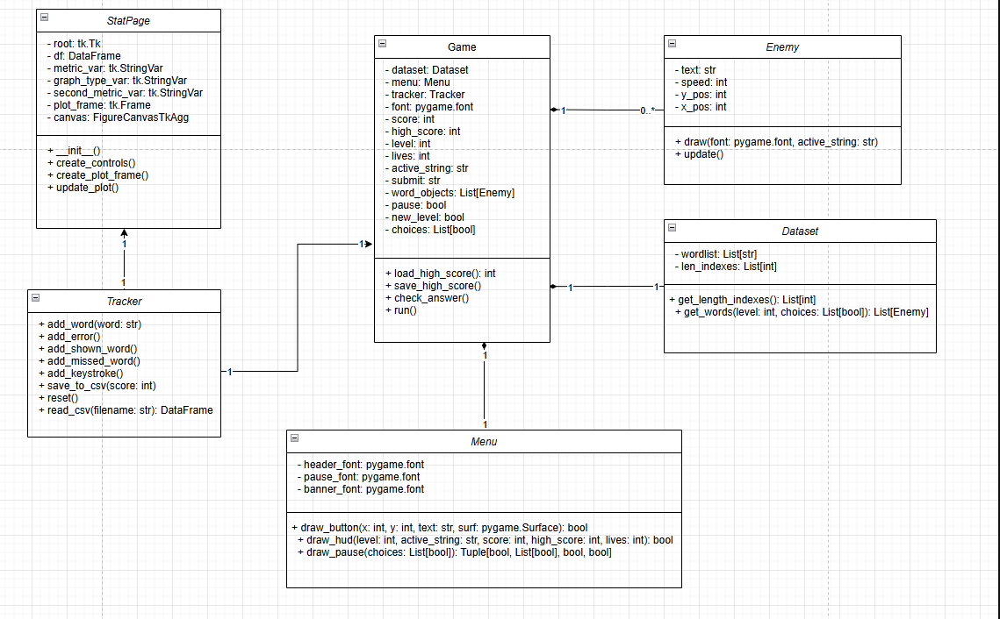

# Type Defender
## 🚀 Project Overview
Type Defender is an innovative action-typing hybrid game that challenges players to defend their base by quickly typing incoming word enemies. Combining the precision of typing tests with the urgency of tower defense gameplay, it offers a unique skill-building experience that tracks and analyzes player performance metrics.

## 🎯 Core Gameplay
- **Defense Mechanic**: Type incoming words before they reach your base
- **Progressive Difficulty**:
  - Enemies get faster
  - Spawn rate increases
- **Performance Tracking**: Real-time WPM, accuracy, and error analytics

## 📊 Data Visualization (Sample)

## UML Diagram

## Core Gameplay Mechanics
- **Dynamic Enemy System**: Words spawn as approaching enemies with varying speeds and lengths
- **Progressive Difficulty**: Enemies become faster and words grow longer as players advance
- **Precision Defense**: Players must exactly match words (case-sensitive) to eliminate threats
- **Base Health System**: Enemies reaching the base deal damage, ending the game at zero health

## Technical Architecture
### OOP Implementation
| Class        | Responsibilities                          | Key Methods                      |
|--------------|------------------------------------------|----------------------------------|
| `Game`       | Main game loop and state management      | `start()`, `end()`, `update()`   |
| `Tracker`    | Performance metrics calculation          | `calculate_wpm()`, `accuracy()`  |
| `Enemy`      | Word enemy behavior                      | `spawn_word()`, `check_typed()`  |
| `Dataset`    | Word database management                 | `load_words()`, `get_random()`   |
| `Menu`       | User interface and input handling        | `display()`, `handle_input()`    |

# Type Defender Statistics Metrics

## Core  Metrics

| Metric | Formula | Description |
|--------|---------|-------------|
| **Net WPM** | `(Correct_Keystrokes / 5) / (Total_Time_Played / 60)` | "True" typing speed excluding errors |
| **Gross WPM** | `(Characters_Typed / 5) / (Total_Time_Played / 60)` | Raw speed including errors |
| **KPM** | `(Correct_Keystrokes / 1000) / (Total_Time_Played / 60)` | Keystrokes per minute (thousands) |

## Accuracy Measurements

| Metric | Calculation | Significance |
|--------|-------------|--------------|
| **Word Accuracy** | `Correct_Words / Total_Words_Typed` | % of fully correct words |
| **Char Accuracy** | `Correct_Keystrokes / Characters_Typed` | % of correct key presses |
| **Error Rate** | `Incorrect_Words / Total_Words_Typed` | Mistakes per word attempted |

## Session Statistics

| Column | Type | Description |
|--------|------|-------------|
| `Score` | Integer | Points earned (speed × accuracy × word length) |
| `Total_Words_Typed` | Count | Sum of correct + incorrect words |
| `Correct_Words` | Count | Perfectly typed words |
| `Incorrect_Words` | Count | Words with ≥1 error |
| `Characters_Typed` | Count | All keys pressed (incl. backspace) |

## Keystroke Analysis

| Metric | What It Tracks | Insight Provided |
|--------|----------------|------------------|
| `Correct_Keystrokes` | Valid character inputs | Typing precision |
| `Backspace_Count` | Backspace key presses | Error correction frequency |
| `Longest_Streak` | Consecutive correct words | Consistency under pressure |

## Timing Metrics

| Metric | Units | Purpose |
|--------|-------|---------|
| `Average_Word_Time` | Seconds | Reaction speed per word |
| `Total_Time_Played` | Seconds | Session duration |

## Word-Level Data

| Column | Description | Game Impact |
|--------|-------------|-------------|
| `Words_Shown` | Total spawned enemies | Difficulty scaling |
| `Words_Missed` | Enemies reaching base | Defense failure rate |
| `Average_Word_Length` | `sum(len(word)) / Words_Shown` | Complexity measure |

